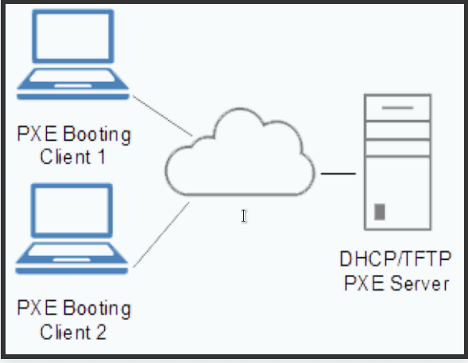

# Загрузка по сети. DHCP/PXE
## Домашнее задание по теме "Загрузка по сети. DHCP/PXE"

[Конфигурация запуска двух тестовых машин, сервер и клиент. Vagrant](./Vagrantfile)  
[Скрипт запуска настройки сервера, для установки CentOS_8 по сети](./setup_pxe.sh)  

>Сревер (сервис TFTP) конфигурируется для возможности установки по сети для  BIOS-клиентов

#   Общая теория, примеры, полезности.

### Конфигурация DHCP сервера

- **Пример опций DHCP сервера**

      subnet 10.5.5.0 netmask 255.255.255.224 {
      range 10.5.5.26 10.5.5.30;
      option domain-name-servers ns1.internal.example.org;
      option domain-name "internal.example.org";
      option domain-search "example.com", "sales.example.com";
      option ntp-servers 10.5.5.2;
      option routers 10.5.5.1;
      }

- **Пример постоянного IP**

host work {
hardware ethernet 08:00:07:26:c0:a5;
fixed-address 10.20.20.10;
}

### Настройка сетевой инсталяции OS

- **Preboot eXecution Environment (PXE)**

Для работы PXE необходимо настроить DHCP сервер:

- **Пример конфигурации DHCP**

      option space pxelinux;
      option pxelinux.magic code 208 = string;
      option pxelinux.configfile code 209 = text;
      option pxelinux.pathprefix code 210 = text;
      option pxelinux.reboottime code 211 = unsigned integer 32;
      option architecture-type code 93 = unsigned integer 16;

      subnet 10.0.0.0 netmask 255.255.255.0 {
      	#option routers 10.0.0.254;
      	range 10.0.0.100 10.0.0.120;

      	class "pxeclients" {
      	  match if substring (option vendor-class-identifier, 0, 9) = "PXEClient";
      	  next-server 10.0.0.20;

      	  if option architecture-type = 00:07 {
      	    filename "uefi/shim.efi";
      	    } else {
      	    filename "pxelinux/pxelinux.0";
      	  }
      	}
      }

- **Менеджеры загрузки PXE**

   1. Syslinux PXELINUX
   2. iPXE - PXE client or extend an existing PXE client implementation

- **PXELINUX config file (default)**

      default menu
      default vesamenu.c32
      prompt 0
      timeout 600

      MENU TITLE PXE Linux setup

      LABEL linux8
        menu label ^Install system linux8
        menu default
        kernel images/CentOS-8.3/vmlinuz
        append initrd=images/CentOS-8.3/initrd.img inst.repo=nfs:10.0.0.20:/mnt/centos8-install
      LABEL linux-auto
        menu label ^Auto install system
        kernel images/CentOS-8.3/vmlinuz
        append initrd=images/CentOS-8.3/initrd.img inst.ks=nfs:10.0.0.20:/home/vagrant/cfg/ks.cfg inst.repo=nfs:10.0.0.20:/mnt/centos8-install
      LABEL vesa
        menu label Install system with ^basic video driver
        kernel images/CentOS-8.3/vmlinuz
        append initrd=images/CentOS-8.3/initrd.img ip=dhcp inst.xdriver=vesa nomodeset
      LABEL rescue
        menu label ^Rescue installed system
        kernel images/CentOS-8.3/vmlinuz
        append initrd=images/CentOS-8.3/initrd.img rescue
      LABEL local
        menu label Boot from ^local drive
        localboot 0xffff

# TFTP конфигурация, настройка.

- **Configuring a TFTP server for UEFI-based clients**

  1. yum install tftp-server
  2. firewall-cmd --add-service=tftp
  3. Configure your DHCP server to use the boot images packaged with shim. A sample configuration in the /etc/dhcp/dhcpd.conf file might look like:

      option space pxelinux;
      option pxelinux.magic code 208 = string;
      option pxelinux.configfile code 209 = text;
      option pxelinux.pathprefix code 210 = text;
      option pxelinux.reboottime code 211 = unsigned integer 32;
      option architecture-type code 93 = unsigned integer 16;

      subnet 10.0.0.0 netmask 255.255.255.0 {
      	option routers 10.0.0.254;
      	range 10.0.0.2 10.0.0.253;

      	class "pxeclients" {
      	  match if substring (option vendor-class-identifier, 0, 9) = "PXEClient";
      	  next-server 10.0.0.1;

      	  if option architecture-type = 00:07 {
      	    filename "shim.efi";
      	  } else {
      	    filename "pxelinux/pxelinux.0";
      		}
        }
      }
  4. Скачать из репозитория локального или удалённого файлы, для загрузки shim.efi и grubx64.efi

      curl -O http://ftp.mgts.by/pub/CentOS/8.3.2011/BaseOS/x86_64/os/Packages/shim-x64-15-15.el8_2.x86_64.rpm
      curl -O http://ftp.mgts.by/pub/CentOS/8.3.2011/BaseOS/x86_64/os/Packages/grub2-efi-x64-2.02-90.el8_3.1.x86_64.rpm

  5. Разархивировать пакеты, достать нужные файлы

      rpm2cpio shim-x64-15-15.el8_2.x86_64.rpm  | cpio -dimv
      rpm2cpio grub2-efi-x64-2.02-90.el8_3.1.x86_64.rpm | cpio -dimv

  6. Создать каталог и скопировать файлы

      cp ./boot/efi/EFI/centos/grubx64.efi /var/lib/tftpboot/uefi/
      cp ./boot/efi/EFI/centos/shimx64.efi /var/lib/tftpboot/uefi/shim.efi    <---- Переименовать файл shimx64.efi в shim.efi

  7. Создать конфиг файл grub.cfg

      cat> /var/lib/tftpboot/uefi/grub.cfg <<EOF

      set timeout=60
      menuentry 'CentOS 8' {
      linuxefi images/CentOS-8.3/vmlinuz ip=dhcp inst.repo=nfs:10.0.0.20:/mnt/centos8-install
      initrdefi images/CentOS-8.3/initrd.img

      }
      EOF
  8. Копирование файлов vmlinuz и initrd

      cp {vmlinuz,initrd.img} /var/lib/tftpboot/pxelinux/images/CentOS-8.3
